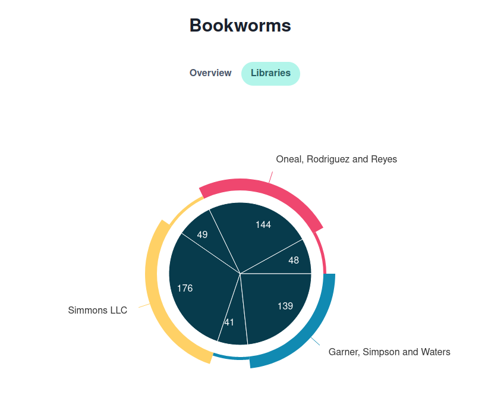
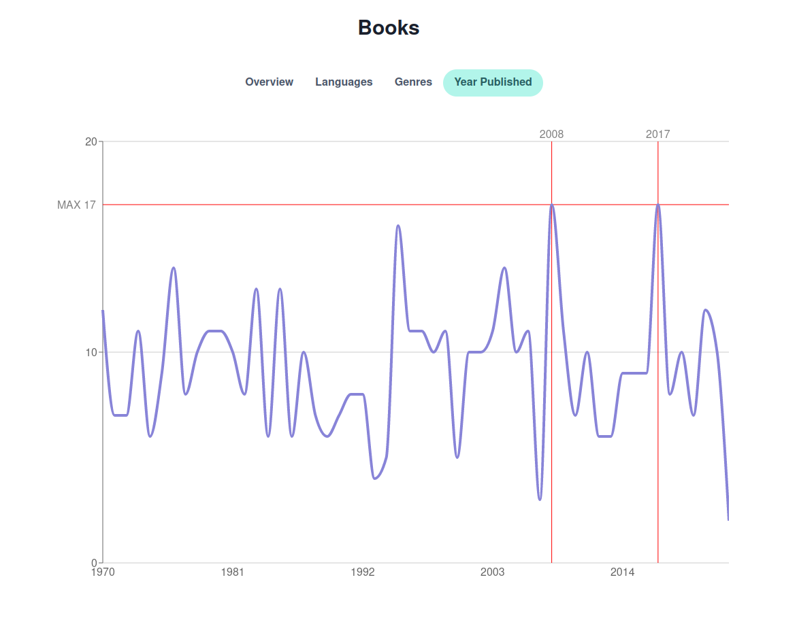
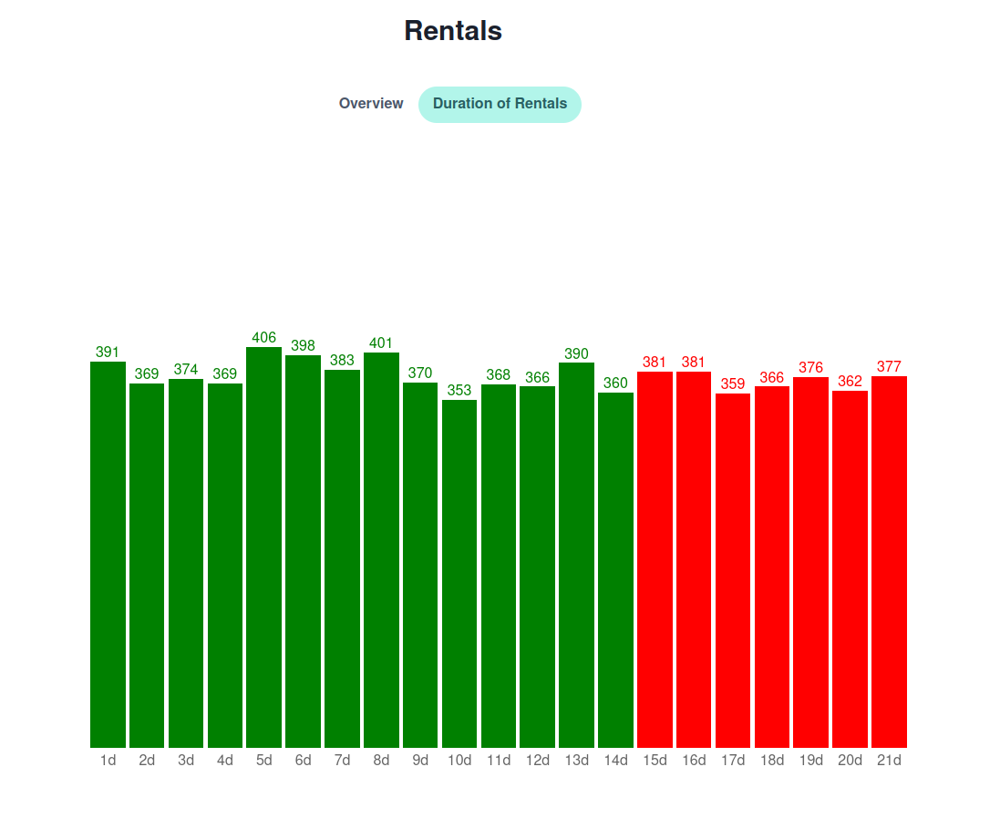
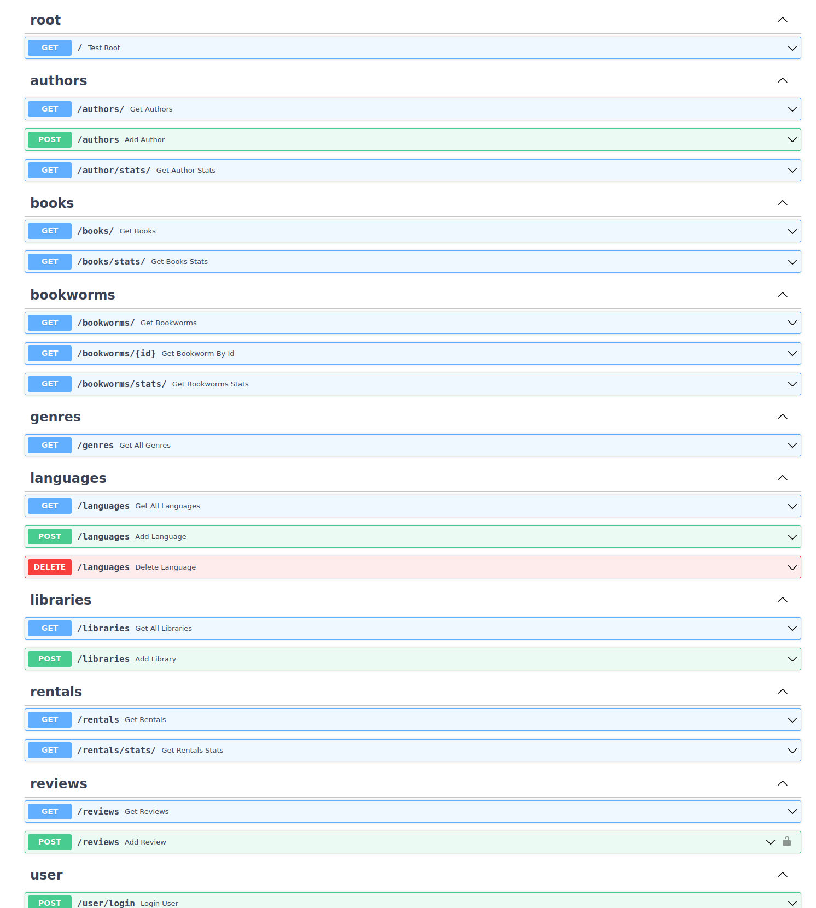

# What is this?

A project to connect and try out some libraries, tools and techniques in a semi-docker environment.

## Frontend

- TypeScript
- React
- Overmind
- Chakra ui
- React Hook Form
- Recharts

## Backend

- Python
- Fastapi

## Database

- Postgres
- SQL
- Bash

## Test

- Cypress
- Vitest

## Screenshots

## Documentation for API

Swagger docs at localhost:8000/docs

# Commands

Run backend for dev

> docker-compose --profile backend-only -f docker-compose.yml -f docker-compose.dev.yml up

#

Seed database for dev

> docker exec -it bw_backend bash

> cd database/dummy_data

> bash set_up_db.sh

> exit

#

run frontend for dev

> cd frontend

> yarn dev

#

see logs for service

> docker-compose logs <NAME OF SERVICE>

#

start specific service

> docker-compose up <NAME OF SERVICE>

#

log into container

> docker exec -it <NAME OF CONTAINER> bash

#

stop containers

> docker-compose down

stop development container and remove volume

> docker-compose -f docker-compose.yml -f docker-compose.dev.yml down -v

#

seed database

> docker-compose run backend bash

> cd database/dummy_data

> bash set_up_db.sh

#

format python

> docker-compose run backend bash

> black .

#

stop bash in terminal

> exit

> docker-compose stop

#

run cypress test (needs work)

> cd test

> npm run cy:open

> npm run cy:run
